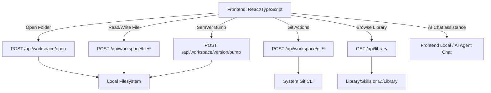

# AgentForgeMD Skill Wizard & IDE Workspace Implementation Plan

This plan details the design, architecture, and step-by-step changes required to implement the **Skill Package Workspace Wizard**, **IDE Workspace File Tree**, **Library Browser**, **SemVer Versioning Automation**, and **AI Agent Chat** within AgentForgeMD.

---

## 🏗️ Architectural Overview

We will evolve AgentForgeMD from a single-file Markdown editor into a fully fledged local development environment (IDE) for Agent Skill Packages (adhering to the `agentskills.io` standard).

### 📁 Proposed Project Directories

* **Backend (`server/index.ts`)**: Integrate Node.js `fs/promises`, `path`, and `child_process` to expose directory scanning, file operations, git integration, and version bumping.
* **Frontend (`client/src/components/*`)**:
  * `WorkspaceTree.tsx`: A tree view sidebar for navigating files and folders recursively, with context menus for create/delete/rename.
  * `LibraryBrowser.tsx`: A modal browser that lets users view and choose skills in `E:\Library\Skills` or the local project `Library/`.
  * `SkillWizard.tsx`: A modal/wizard dialog to scaffold a new skill structure (`SKILL.md` + empty folders `scripts/`, `references/`, `assets/`, `themes/`).
  * `AgentChatPanel.tsx`: A sliding sidebar chat interface populated with pre-configured personas like **Prompt Expert**, **Instruction Architect**, and **Code Architect**.
  * `GitPanel.tsx`: A panel to display git status, stage, commit, and automate version bumping.

---

## 📋 Task Checklist

### Phase 1: Backend API Setup (express)
- [ ] Add JSON parsing middleware to `server/index.ts`.
- [ ] Implement `getLibraryPath()` helper to dynamically find `Library` (local project or `E:\Library`).
- [ ] Implement `buildTree()` recursive directory scanner helper.
- [ ] Implement `/api/library` directory browser route.
- [ ] Implement `/api/workspace/open` route with git validation.
- [ ] Implement `/api/workspace/file/read`, `/api/workspace/file/write`, `/api/workspace/file/create`, `/api/workspace/file/delete`, `/api/workspace/file/rename` routes.
- [ ] Implement `/api/workspace/git/init`, `/api/workspace/git/status`, `/api/workspace/git/commit` routes.
- [ ] Implement `/api/workspace/version/bump` route for SemVer updates in `SKILL.md`.

### Phase 2: Core Components & Context
- [ ] Create `WorkspaceTree.tsx` component with interactive folder toggles and context actions (New File, New Folder, Rename, Delete).
- [ ] Create `LibraryBrowser.tsx` modal browser component.
- [ ] Create `SkillWizard.tsx` workspace-creation wizard.
- [ ] Create `AgentChatPanel.tsx` with markdown rendering and persona presets.
- [ ] Implement Git integration UI panel.

### Phase 3: Editor Layout Integration
- [ ] Modify `Home.tsx` to support a sidebar state (`showSidebar`) and active workspace state (`activeWorkspaceDir`).
- [ ] Integrate workspace file selection with tab loading: clicking a file in the workspace loads it as a tab in the editor.
- [ ] Replace or add top-level toolbar buttons for **Workspace**, **Library**, and **Agent Chat**.
- [ ] Support saving workspace files back to disk upon editing and switching tabs.

### Phase 4: Verification & Testing
- [ ] Rebuild and run the production server.
- [ ] Verify directory opening, file tree rendering, file modification writes, git commits, version bumping, and chat functions.
